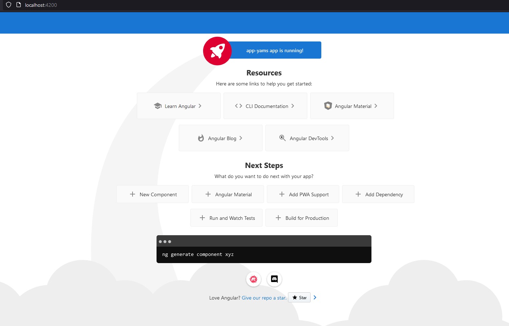
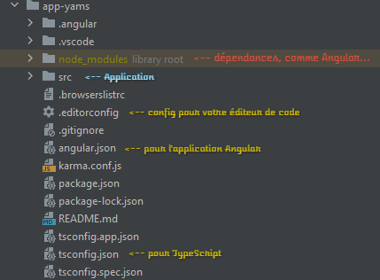
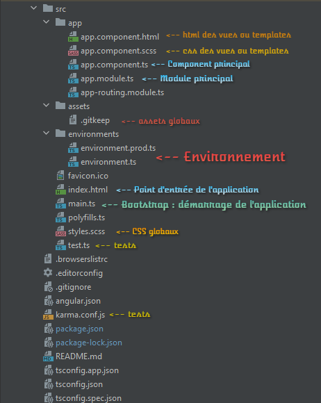

# Projet Application fil rouge : app-yams

Vous allez développer une petite application de yams avec un catalogue de lots (pâtisseries) 
avec un petit moteur de recherche.

On développera également un espace sécurisé pour administrer le catalogue en
mettant en place un CRUD (create/read/update/delete).

Une fois terminée on verra comment déployer l’application sur un serveur distant.

Cette application sera notre fil rouge pour découvrir les concepts fondamentaux
d’Angular.

## Installation & configuration

Vous allez tout d’abord installer Angular dans le dossier app-yams sur votre
bureau. Pour créer un nouveau projet Angular vous allez d’abord récupérer sur
votre machine le package node angular-cli, outils en ligne de commande qui nous
aidera à créer les fichiers, compiler et déployer l’application :

```bash
npm install -g @angular/cli
```

*ou plus simplement :*

```bash
npm i -g @angular/cli
```

Puis, dans un terminal vous allez taper la ligne suivante cela va créer un dossier
et télécharger les sources du framework Angular et de l’application.

Nous allons choisir une installation avec la gestion des scss et sans la gestion des
tests unitaires pour l’instant :

```bash
ng new app-yams --style=scss --skip-tests=true
```

Bien entendu, sur un nouveau projet, vous accepterez d'ajouter le routing angular.

*Remarques si vous souhaitez faire une installation standard vous ne taperez pas
les options de commande :*

```bash
ng new app-yams
```

Si jamais vous veniez à rencontrer cette erreur sous Windows :


tout ce que vous aurez à faire est de :

- Démarrer **Windows Powershell, en tant qu’Administrateur**.
- Taper la commande suivante :
  ```bash
  set-executionpolicy unrestricted
  ```
  
Puis vous pourrez relancer une installation du projet.

Angular-cli est un outil en ligne de commande, il va vous permettre de créer,
build et mettre en production votre application. C’est un outil indispensable.

Pour lancer l’application et build les modifications en temps réelles tapez la
ligne de commande suivante, Angular lancera un serveur de test sur le port 4200

*Commande standard :*

```bash
ng serve -o
```

*Commande équivalente avec une option pour changer le port :*

```bash
ng serve -o --port 4300
```

Une fois cette commande lancée vous devriez avoir dans votre navigateur par
défaut la page suivante qui s’affiche :



## Présentation des dossiers et fichiers Angular



## Les dossiers de l’application src



## Architecture de l’application

Angular est construit à partir de components hiérarchiques écrits en TypeScript :
ce sont les « contrôleurs » de l’application. Chaque Component possède sa
propre vue et ses propres CSS qui sont par défaut isolés (portées des CSS) dans
le component lui-même.

Les modules encapsulent (isolent) les Components dans des unités logiques de
votre application : partie publique du site ou partie privée, page d’inscription,
etc.

Les services séparent la logique du code des Components, ils sont factorisables
et réutilisables dans l’application. On fera de l’injection de dépendance pour
consommer un service unique dans les Components.

Les directives agissent sur les données dans les templates.

Les équipes de développement d’Angular propose un schéma détaillants cette
architecture :


## Installation des CSS ou SCSS

Pour l’instant on ne veut pas se soucier de la mise en page de notre application,
nous installerons simplement le Bootstrap :

*installation local des CSS (dossier node_modules)*

```bash
npm install bootstrap --save
```

Puis dans la partie (clé) architect du fichier angular.json du dossier app-yams
de l’application ajoutez la ligne suivante :

```json
"styles": [
"src/styles.scss",
"./node_modules/bootstrap/dist/css/bootstrap.min.css"
],
"scripts": []
},
```

Relancez le serveur local de test pour tester, tapez en ligne de commande “Ctrl+ c”,
n’oubliez pas également la commande suivante :

```bash
ng serve -o
```

## Structure de la page principale de notre application

La page principale listera les pâtisseries à gagner.

Dans le menu principal on pourra aller sur la page de connexion et une fois
authentifié on pourra aller sur le dashboard. Un lien de déconnexion “logout”
sera utilisable pour se déconnecté.

Récupérez les sources du projet de ce chapitre.

La partie HTML est à récupérer dans le fichier app.html, elle vous sert d’exemple,
nous l’utiliserons dans les différents components qui structurent notre application.

Vous l’utiliserez au fur et à mesure pour structurer la/les page(s), ne la recopiez
pas directement dans le fichier app.component.html pour l’instant.


Fin de ce chapitre, merci de l’avoir suivi.